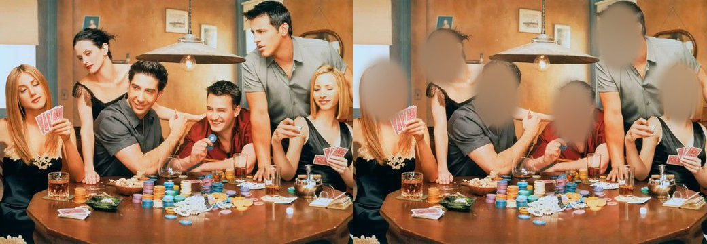
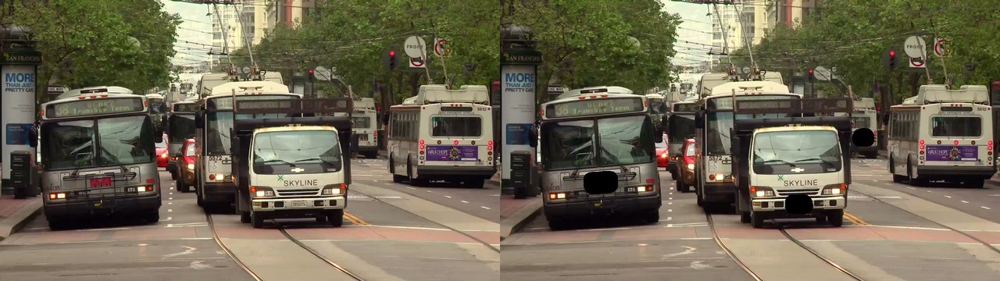
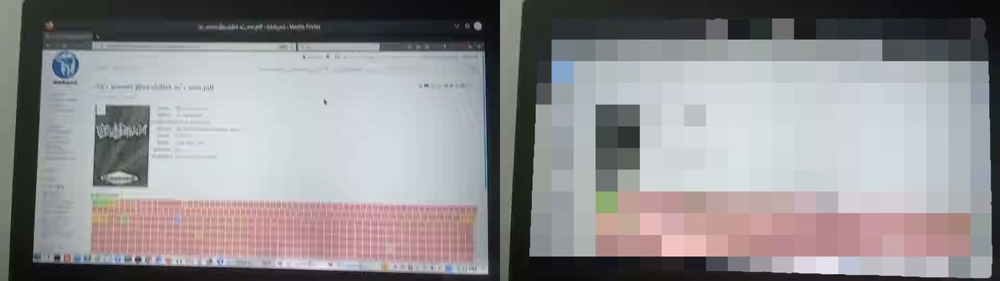
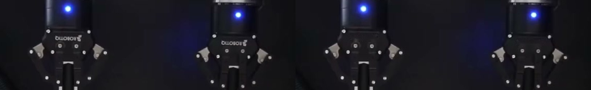

# SafeVlog3

**영상을 올려두면, 어떤 개인정보가 노출됐는지 알려주고 안전한 편집안을 제시하는 서비스.**

브이로그·강의·인터뷰 영상에는 의도치 않게 타인의 얼굴, 신분증, 모니터 화면, 명패, 문서 같은 개인정보(PII)가 찍히는 경우가 많습니다. SafeVlog3는 이걸 직접 일일이 찾아서 가릴 필요 없이, 영상을 업로드하면 자동으로 위험요소를 식별하고 어떻게 처리할지 가이드합니다.

---

## 사용자 흐름

```
영상 업로드  →  자동 분석  →  위험 리포트 + 가이드라인 확인  →  선택  →  안전한 영상 다운로드
```

사용자가 하는 일은 **업로드 → 선택 → 다운로드** 세 가지뿐입니다.

### 1. 업로드

영상을 잡 큐에 올립니다. 그 즉시 분석이 시작되고, 사용자는 떠나도 됩니다 — 잡은 백그라운드에서 진행되며 처리 로그는 실시간으로 스트리밍됩니다.

### 2. 자동 분석 (사용자 개입 없음)

서비스가 자동으로:

- **씬을 이해합니다** — "이건 카페 브이로그", "사무실에서 촬영된 인터뷰", "차량/도로 영상" 같은 맥락을 파악하고, 해당 씬에서 등장할 법한 PII 종류를 미리 예측합니다 (예: 사무실 → 모니터 화면, 명패, 문서 / 차량 → 번호판).
- **위험요소를 찾습니다** — 영상에 실제로 등장한 얼굴과 비얼굴 PII를 픽셀 단위로 식별합니다.
- **인물을 구분합니다** — 영상에 여러 사람이 나오면 누가 누구인지 구분해서 "인물 1", "인물 2"로 보여줍니다. 본인은 보호하고 행인은 가리는 식의 선택이 가능합니다.

### 3. 위험 리포트 + 편집 가이드라인

분석이 끝나면 두 가지가 제공됩니다.

**(a) 후보 목록** — 영상에서 발견된 항목을 썸네일과 함께 보여줍니다.
- 인물별 얼굴 썸네일 (몇 프레임에 등장했는지 포함)
- 비얼굴 PII 썸네일 (신분증/모니터/문서/명패/번호판 등 카테고리 판단용 예시)

**(b) 편집 가이드라인** — 사람이 검토할 때 놓치기 쉬운 부분을 짚어줍니다. 예시:
- "인물 1번과 3번이 동일인일 가능성이 높습니다 (유사도 0.52)" — 조명/각도 차이로 분리된 클러스터 자동 경고
- "사무실 씬에서는 모니터 화면 노출에 특히 주의하세요" — 씬 기반 권고
- "신분증이 0:42 부근에서 잠깐 등장합니다" — 짧게 스쳐 지나가는 항목 알림

### 4. 사용자 선택

- 어떤 인물을 **보호**할지 클릭 (선택하지 않은 얼굴은 모두 블러)
- 어떤 PII **카테고리**를 전체 영상에서 마스킹할지 선택 (기본값: 감지된 카테고리 전부 마스킹)

이 선택은 **프로필로 저장**해서 다음 영상에 그대로 재사용할 수 있습니다. 매번 같은 사람들과 촬영한다면 한 번 설정으로 끝.

> 편집이 필요 없다고 판단되면 "스킵" 한 번으로 원본 그대로 완료 처리할 수도 있습니다.

### 5. 다운로드

- 마스킹이 적용된 결과 영상 (mp4)
- 처리 내역 JSON 리포트 (몇 명 감지, 몇 개 얼굴 블러, 어떤 PII 카테고리를 마스킹했는지)

---

## 마스킹 품질

서비스가 신경 쓰는 디테일:

- **자연스러운 경계** — 직사각형 박스가 아니라 픽셀 단위 polygon으로 가립니다. 얼굴이 머리카락에 가려진 부분이나 손에 들린 신분증의 모서리까지 정확하게 처리됩니다.
- **프레임 단위 재탐지** — 원본 fps 프레임마다 SAM3 이미지 탐지를 다시 수행해, 이전 프레임 마스크가 고정되어 남는 문제를 피합니다.
- **identity 기반 보호** — 단순히 "첫 번째 얼굴 = 본인" 같은 위치 기반이 아니라, 얼굴 embedding으로 인물을 인식하기 때문에 본인이 화면 어디에 있든 정확히 보호됩니다.
- **PII 종류별 적절한 처리** — 얼굴은 블러, 텍스트/번호판은 blackbox, 화면은 pixelate, 상품 로고/상표는 주변 색상 기반 자연 채움 등 종류에 맞는 마스킹 방식을 자동 선택합니다. `DEBUG_MASK_OVERLAY=true`일 때만 테스트 확인용 컬러 오버레이를 덧입힙니다.

### 마스킹 예시

아래 예시는 로컬 샘플에서 뽑은 대표 프레임입니다. 각 이미지는 하나의 카테고리만 보여주며, 왼쪽은 원본, 오른쪽은 마스킹본입니다.

**얼굴**



**번호판**



**화면**



**상품 로고/상표**



---

## 상태와 진행 로그

각 잡은 다음 상태를 거칩니다:

| 상태 | 의미 |
|---|---|
| `detecting` | 영상 분석 중 (씬 파악, 얼굴/PII 탐지) |
| `generating_guideline` | 위험 리포트와 가이드라인 작성 중 |
| `awaiting_selection` | 사용자 선택 대기 |
| `masking` | 선택대로 마스킹 적용 중 |
| `done` | 완료 — 다운로드 가능 |
| `failed` | 실패 — 오류 메시지 확인 |

처리 중에는 SSE 스트림으로 진행 상황을 받아볼 수 있어, 프론트엔드 UI에서 "n/m 프레임 처리 중..." 같은 상세 로그가 실시간으로 보입니다.

---

## 잡 큐 관리

- 잡은 비동기로 처리되므로 여러 영상을 연속으로 올려도 됩니다.
- 잡 목록 API에서 전체 큐 상태를 한눈에 확인할 수 있습니다.
- 처리 끝난 영상은 원본·결과·리포트를 각각 다시 받을 수 있습니다.

---

## 사용 시나리오

| 누가 | 왜 |
|---|---|
| 브이로거 | 카페·거리 촬영 시 행인 얼굴 자동 블러 |
| 사내 콘텐츠 제작자 | 회의실 화면, 명패, 문서 자동 마스킹 |
| 교육 콘텐츠 강사 | 본인 얼굴은 살리고 학생/청중은 모두 가림 |
| 인터뷰 영상 편집자 | 인터뷰이만 보호, 배경 인물·소품은 자동 마스킹 |
| 기자/저널리스트 | 익명 제보자 보호 + 배경 PII 일괄 처리 |
| 자동차 리뷰/블랙박스 채널 | 차량 번호판을 자동 감지하고 마스킹 처리 |

---

## 기술 스택 (참고)

- **씬 이해 / 가이드라인**: GPT-4o
- **PII 픽셀 탐지**: Meta SAM3 이미지 탐지(per-frame)
- **인물 identity**: InsightFace
- **백엔드**: FastAPI (Python 3.12)
- **프론트엔드**: React + Vite

---

## 설치 및 실행

### 사전 준비

- Python 3.12 / Node.js 20+ / NVIDIA GPU (권장) / ffmpeg
- OpenAI API 키
- HuggingFace 계정 + [facebook/sam3](https://huggingface.co/facebook/sam3) 접근 승인

### 설치

```bash
# 시스템 패키지
sudo apt install -y python3.12-venv python3-pip ffmpeg build-essential git

# Python 환경 + PyTorch (CUDA 12.8 기준; 본인 환경에 맞게 조정)
cd safer
python3 -m venv .venv
source .venv/bin/activate
pip install --upgrade pip setuptools wheel
pip install torch==2.10.0 torchvision --index-url https://download.pytorch.org/whl/cu128

# SAM3 (pip 패키지 없음, github에서 직접 설치)
git clone https://github.com/facebookresearch/sam3.git ~/sam3_repo
pip install -e ~/sam3_repo
pip install "setuptools<81" "numpy<2" psutil pycocotools einops scipy hydra-core decord

# 프로젝트 의존성
pip install -r requirements.txt

# SAM3 가중치
hf auth login
hf download facebook/sam3 sam3.pt --local-dir checkpoints

# 프론트엔드
cd frontend && npm install && cd ..

# 환경변수
cp .env.example .env   # OPENAI_API_KEY 입력
```

### 실행

```bash
# 백엔드 (8000)
source .venv/bin/activate
uvicorn backend.main:app --reload

# 프론트엔드 (5173) — 별도 터미널
cd frontend && npm run dev
```

브라우저에서 `http://localhost:5173` 접속.

---

## API 요약

내부 통합이나 자동화를 위한 REST API:

| 단계 | 엔드포인트 |
|---|---|
| 영상 업로드 | `POST /api/jobs` |
| 잡 목록/상태 | `GET /api/jobs` · `GET /api/jobs/{id}/status` |
| 진행 로그 (SSE) | `GET /api/jobs/{id}/stream` |
| 위험 후보 확인 | `GET /api/jobs/{id}/candidates` |
| 가이드라인 확인 | `GET /api/jobs/{id}/guideline` |
| 사용자 선택 제출 | `POST /api/jobs/{id}/selection` |
| 편집 스킵 | `POST /api/jobs/{id}/skip` |
| 결과/원본/리포트 다운로드 | `GET /api/jobs/{id}/download` · `/original` · `/report` |
| 프로필 저장/조회/적용/삭제 | `POST /api/jobs/{id}/save-profile` · `GET /api/profiles` · `GET /api/jobs/{id}/apply-profile/{pid}` · `DELETE /api/profiles/{pid}` |
| 서비스 헬스체크 | `GET /health` |

---

## 환경변수

| 키 | 기본값 | 설명 |
|---|---|---|
| `OPENAI_API_KEY` | (필수) | GPT-4o 씬 분석 + 가이드라인 |
| `SAMPLE_FPS` | `1` | 탐지 단계 프레임 추출 fps (마스킹은 원본 fps 유지) |
| `MAX_VIDEO_SIZE_MB` | `500` | 업로드 최대 크기 |
| `FACE_DETECT_INTERVAL` | `10` | InsightFace 실행 간격 (탐지 프레임 N개당 1번) |
| `SCENE_ANALYSIS_FRAMES` | `5` | GPT-4o 씬 분석 프레임 수 (병렬 투표) |
| `FACE_SIMILARITY_THRESHOLD` | `0.55` | 동일인 판정 임계값 |
| `SAM3_CONFIDENCE_THRESHOLD` | `0.3` | SAM3 탐지 신뢰도 임계값 |
| `DEBUG_MASK_OVERLAY` | `false` | 테스트 확인용 컬러 마스크 오버레이 적용 여부 |
| `UPLOAD_DIR` / `OUTPUT_DIR` | `uploads` / `outputs` | 저장 경로 |
| `SAM3_CHECKPOINT` | `checkpoints/sam3.pt` | SAM3 가중치 경로 |

---

